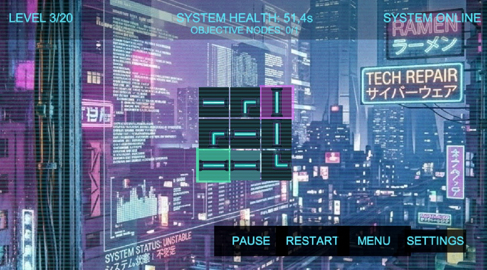
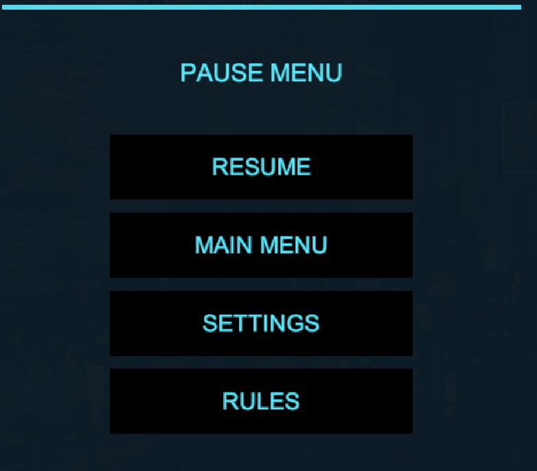
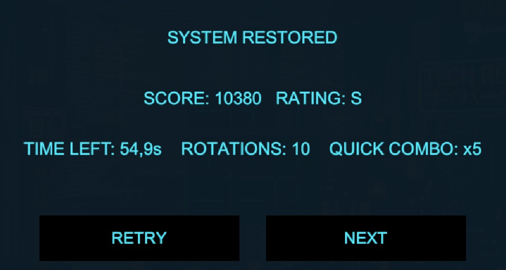

# Звіт до лабораторної роботи

## 1. Титульна частина

- Назва дисципліни: ` Геймдизайн та програмування ігрових застосунків`
- Тема лабораторної роботи: `Створення базового ігрового прототипу та реалізація основних ігрових механік`
- Назва проєкту: `System Breach: Overdrive`
- Виконали: `Гарлінський Кирило, Купець Олексій, Чубок Богдан`
- Група: `КН-3/1`
- Дата виконання: `19.04.2026`

## 2. Тема роботи

Розробка першої працездатної версії ігрового застосунку в Unity з реалізацією базового ігрового циклу, основних дій гравця та ключових механік взаємодії з ігровим середовищем.

## 3. Мета роботи

Створити мінімально життєздатний прототип гри відповідно до Game Design Document, перевірити працездатність основних механік, налаштувати демонстраційну сцену та зафіксувати результати виконання роботи в Git-репозиторії.

## 4. Опис реалізованого прототипу

У межах лабораторної роботи реалізовано базовий ігровий прототип логічної 2D-гри `System Breach: Overdrive` у середовищі Unity. Гравець взаємодіє з ігровим полем у вигляді сітки вузлів мережі, обертаючи елементи для побудови коректного маршруту сигналу від джерела до виходу.

Прототип побудовано як MVP-версію, достатню для перевірки основного ігрового циклу. Було створено демонстраційну сцену, налаштовано базове середовище проєкту, підключено необхідний інтерфейс, реалізовано таймер рівня, умови перемоги та поразки, а також базову взаємодію гравця з елементами ігрового поля.

До складу MVP входять:

- одна працездатна демонстраційна сцена;
- генерація ігрової сітки;
- обертання вузлів мишею;
- перевірка наявності правильного шляху сигналу;
- таймер проходження рівня;
- умови успіху та завершення спроби;
- базовий HUD для відображення стану гри.

## 5. Короткий опис виконаної роботи

У роботі реалізовано ідею логічної гри, у якій користувач повинен відновити маршрут сигналу в цифровій мережі до завершення часу рівня. Для демонстрації прототипу було використано одну базову сцену з ігровим полем, вузлами, інтерфейсом та службовими об’єктами керування логікою гри.

Для MVP було обрано лише основні механіки, необхідні для демонстрації концепції:

- формування ігрового поля у вигляді сітки;
- взаємодія з вузлами через обертання;
- перевірка правильності побудованого шляху;
- відлік часу;
- завершення рівня у випадку перемоги або поразки;
- відображення базової інформації в інтерфейсі.

## 6. Перелік реалізованих механік

### 6.1. Генерація ігрової сітки

- Назва механіки: `Grid System`
- Призначення: формування ігрового поля, на якому розміщуються вузли мережі.
- Результат реалізації: створено робоче поле у вигляді сітки, яка використовується як основа для всієї взаємодії в грі.

### 6.2. Обертання вузлів

- Назва механіки: `Node Rotation`
- Призначення: надання гравцю можливості змінювати орієнтацію елементів мережі.
- Результат реалізації: вузли можна обертати натисканням лівої кнопки миші для побудови правильного маршруту.

### 6.3. Перевірка шляху сигналу

- Назва механіки: `Signal Validation`
- Призначення: визначення, чи з’єднано джерело сигналу з вихідним вузлом відповідно до правил рівня.
- Результат реалізації: після змін на полі система перевіряє побудований маршрут і фіксує стан проходження.

### 6.4. Таймер рівня

- Назва механіки: `Timer System`
- Призначення: обмеження часу, відведеного на проходження рівня.
- Результат реалізації: під час гри відображається таймер, після завершення якого рівень вважається програним.

### 6.5. Умови перемоги та поразки

- Назва механіки: `Level Result`
- Призначення: завершення поточної спроби залежно від стану ігрового поля та часу.
- Результат реалізації: у разі правильного маршруту фіксується перемога, а у разі завершення часу — поразка.

### 6.6. Базовий інтерфейс користувача

- Назва механіки: `HUD`
- Призначення: відображення поточного стану гри та допоміжної інформації для гравця.
- Результат реалізації: у прототипі відображаються ключові елементи інтерфейсу, зокрема таймер, статус гри та меню.

## 7. Реалізований основний ігровий цикл

Основний цикл гри у прототипі реалізовано таким чином:

1. Завантажується сцена та ініціалізується ігрове поле.
2. Генерується сітка вузлів і запускається таймер рівня.
3. Гравець взаємодіє з вузлами, обертаючи їх для побудови маршруту сигналу.
4. Після кожної дії перевіряється правильність з’єднання.
5. Якщо маршрут побудовано коректно, рівень завершується успішно.
6. Якщо час спливає раніше, фіксується поразка.

Таким чином, реалізований цикл відповідає концепції, описаній у GDD, і дозволяє перевірити життєздатність базового задуму гри.

## 8. Використані сцени та об’єкти

Для демонстрації прототипу використано одну основну сцену:

- `Assets/Scenes/SampleScene.unity` — демонстраційна сцена з робочим ігровим прототипом.

У сцені використано такі базові компоненти:

- ігрове поле у вигляді сітки вузлів;
- джерело та вихід сигналу;
- елементи HUD;
- об’єкт контролера гри;
- допоміжні візуальні ресурси для відображення вузлів та фону.

## 9. Change log

- створено базову сцену та структуру Unity-проєкту;
- реалізовано генерацію сітки та обертання вузлів;
- додано перевірку шляху сигналу, таймер і завершення рівня;
- оформлено базовий HUD, службові інструменти редактора та документацію;
- виконано фіксацію етапів роботи в Git через окремі коміти.

## 10. Перевірка працездатності

Під час тестування в режимі `Play Mode` перевірено:

- відкриття демонстраційної сцени;
- відображення ігрового поля та HUD;
- обертання вузлів мишею;
- роботу таймера;
- реакцію гри на успішне проходження;
- відображення результату після завершення раунду.

За результатами перевірки базові механіки MVP працюють коректно та можуть бути використані як основа для подальшого розвитку проєкту.

## 11. Скріншоти

### Скріншот 1. Ігровий процес

Файл: `Screenshot_1.jpg`

### Скріншот 2. Меню

Файл: `Screenshot_2.jpg`

### Скріншот 3. Результат після проходження раунду

Файл: `Screenshot_3.jpg`

## 12. Посилання на репозиторій та коміти

- Репозиторій: `https://github.com/kupetsovkn24-lgtm/system-breach-overdrive`
- Робоча інтеграційна гілка: `dev`

Ключові коміти:

- `f17d7fb` — `Configure Unity project and demo scene`
- `6330b7c` — `Add node data and level configuration`
- `a1897b8` — `Add grid generation and signal validation`
- `45b2dfe` — `Add gameplay flow, timer, and HUD`
- `4a90ac1` — `Add editor utilities and project documentation`

За потреби у фінальній версії звіту можна вставити прямі посилання на коміти:

- `https://github.com/kupetsovkn24-lgtm/system-breach-overdrive/commit/f17d7fb`
- `https://github.com/kupetsovkn24-lgtm/system-breach-overdrive/commit/6330b7c`
- `https://github.com/kupetsovkn24-lgtm/system-breach-overdrive/commit/a1897b8`
- `https://github.com/kupetsovkn24-lgtm/system-breach-overdrive/commit/45b2dfe`
- `https://github.com/kupetsovkn24-lgtm/system-breach-overdrive/commit/4a90ac1`

## 13. Висновок

У результаті виконання лабораторної роботи було створено базовий працездатний прототип гри `System Breach: Overdrive` у середовищі Unity. Реалізовано основні механіки, необхідні для демонстрації концепції: генерацію ігрового поля, обертання вузлів, перевірку маршруту сигналу, таймер рівня, умови перемоги та поразки, а також базовий інтерфейс користувача.

Реалізовані механіки працюють коректно в межах MVP та дозволяють продемонструвати основний ігровий цикл. Подальшого доопрацювання потребують розширення контенту, ускладнення рівнів, покращення інтерфейсу та полірування візуальної частини, однак поточна версія вже є достатньою для демонстрації результатів лабораторної роботи.
