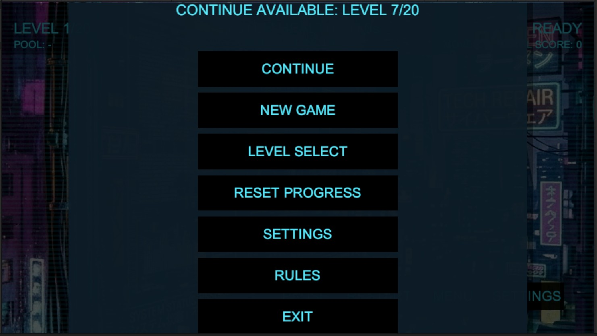
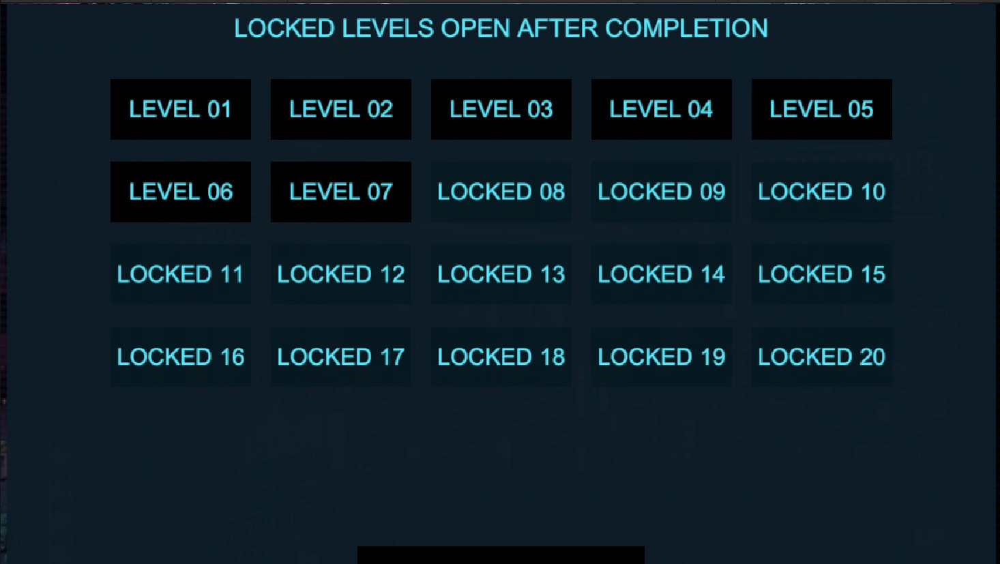
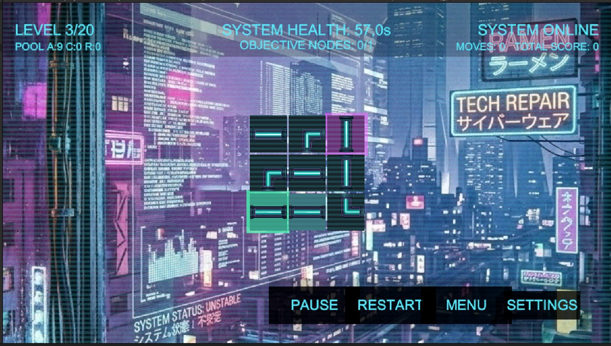
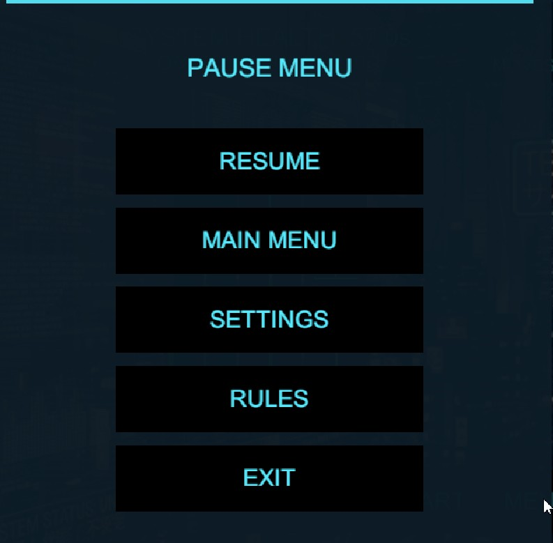
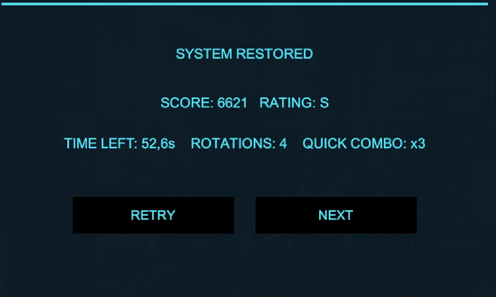

# Звіт до лабораторної роботи 6

## 1. Титульна частина

- Назва дисципліни: `Геймдизайн та програмування ігрових застосунків`
- Тема лабораторної роботи: `Фіналізація ігрового проєкту, полішинг, тестування та підготовка до захисту`
- Назва проєкту: `System Breach: Overdrive`
- Виконали: `Гарлінський Кирило, Купець Олексій, Чубок Богдан`
- Група: `КН-3/1`
- Дата виконання: `06.06.2026`

## 2. Тема роботи

Фіналізація Unity-прототипу гри `System Breach: Overdrive` до демонстраційної версії, перевірка основних механік, підготовка матеріалів для захисту та опис фінального стану проєкту.

## 3. Мета роботи

Перевірити працездатність поточної demo-версії гри, зафіксувати реалізовані елементи, провести базове тестування, підготувати звіт, скріншоти та демонстраційний сценарій для захисту проєкту.

## 4. Опис фінальної версії гри

`System Breach: Overdrive` це 2D puzzle-гра у стилі кіберпанкового терміналу. Гравець керує вузлами цифрової мережі та має відновити маршрут сигналу від джерела до цільових вузлів до завершення таймера `SYSTEM HEALTH`.

Фінальна демонстраційна версія містить:

- ігрове поле у вигляді сітки мережевих вузлів;
- обертання вузлів лівою кнопкою миші;
- перевірку з'єднання сигналу з цільовими вузлами;
- таймер проходження рівня;
- перемогу, поразку, повтор рівня та перехід до наступного рівня;
- систему з 20 прогресивних рівнів;
- головне меню, вибір рівня, pause menu, rules, settings і result screen;
- HUD з таймером, номером рівня, прогресом цілей, кількістю ходів, рахунком і станом Object Pool;
- базові візуальні ефекти: scanline overlay, flash-ефекти, pulse-ефект сигналу;
- базові звукові ефекти для обертання вузла, перемоги та поразки.

## 5. Перелік фіналізованих елементів

### 5.1. Основні механіки

У фінальній версії перевірено та залишено без змін основні механіки прототипу:

- `Grid System` - генерація сітки вузлів;
- `Node Rotation` - обертання доступних вузлів;
- `Signal Validation` - перевірка маршруту сигналу;
- `Timer System` - обмеження часу проходження;
- `Level Result` - обробка перемоги та поразки;
- `Level Progression` - відкриття наступних рівнів після проходження.

### 5.2. HUD та UI

Фінальний HUD відображає:

- номер поточного рівня;
- таймер `SYSTEM HEALTH`;
- статус гри;
- прогрес `OBJECTIVE NODES`;
- стан Object Pool;
- кількість ходів `MOVES`;
- загальний рахунок `TOTAL SCORE`.

Також реалізовано такі UI-екрани:

- стартове меню;
- екран вибору рівня `LEVEL SELECT`;
- меню паузи;
- екран правил;
- екран налаштувань;
- екран результатів після перемоги або поразки.

### 5.3. Збереження та налаштування

У грі реалізовано базове збереження через `PlayerPrefs`:

- збереження останнього відкритого рівня;
- збереження значення гучності;
- можливість скидання прогресу через `RESET PROGRESS`.

Окремі налаштування якості графіки не додавалися, оскільки для поточної 2D demo-версії вони не є критичними.

### 5.4. Аудіо

У фінальній версії використано базові runtime-звуки:

- короткий звук при обертанні вузла;
- звук успішного проходження рівня;
- звук поразки.

Повноцінна фонова музика не додавалася, щоб не ускладнювати фінальну збірку та не змінювати вже стабільну demo-версію.

### 5.5. Візуальний полішинг

Для демонстраційної версії залишено та перевірено:

- темний cyberpunk terminal стиль;
- неонові кольори для активних з'єднань;
- scanline overlay;
- flash-ефекти при перемозі, поразці та перевантаженні вузла;
- pulse-анімацію маршруту сигналу після успішного з'єднання.

## 6. Тестування та виправлення помилок

Було проведено базове ручне тестування у режимі Play.

| Що тестувалося | Очікуваний результат | Статус |
| --- | --- | --- |
| Запуск гри | Відкривається стартове меню | Пройдено |
| `NEW GAME` | Запускається перший рівень | Пройдено |
| Обертання вузлів | Незаблоковані вузли обертаються на 90 градусів | Пройдено |
| Заблоковані вузли | Заблоковані вузли не обертаються | Пройдено |
| Таймер | Час зменшується під час гри та зупиняється на паузі | Пройдено |
| Побудова маршруту | При правильному маршруті відкривається result screen | Пройдено |
| Поразка за таймером | Після завершення часу показується `SYSTEM FAILURE` | Пройдено |
| Pause menu | Меню відкривається, гра ставиться на паузу | Пройдено |
| Restart | Поточний рівень перезапускається | Пройдено |
| Level Select | Доступні тільки відкриті рівні | Пройдено |
| Settings | Значення гучності змінюється та зберігається | Пройдено |
| Reset Progress | Прогрес проходження скидається | Пройдено |

Критичних помилок, які блокують демонстрацію гри, не виявлено. Для подальшого розвитку можна додати фонову музику, більше сценових асетів, окрему стартову сцену та розширені налаштування графіки.

## 7. Change log

- проаналізовано фінальний стан demo-версії проєкту;
- перевірено основні ігрові механіки;
- перевірено HUD, меню, pause menu, settings, rules і result screen;
- перевірено роботу прогресу рівнів через `PlayerPrefs`;
- перевірено збереження гучності;
- перевірено базові звукові ефекти;
- перевірено базові візуальні ефекти;
- підготовлено скріншоти фінальної версії;
- підготовлено опис smoke-тестування;
- підготовлено демонстраційний сценарій захисту;
- підготовлено фінальний звіт лабораторної роботи 6.

## 8. Скріншоти

До звіту додано 5 скріншотів із фінальної демонстраційної версії. Оскільки код після лабораторної роботи 5 не змінювався, ці скріншоти відображають актуальний фінальний стан проєкту.

### Скріншот 1. Головне меню

Файл: `Screenshot_1.jpg`

### Скріншот 2. Вибір рівня

Файл: `Screenshot_2.jpg`

### Скріншот 3. Ігровий процес з активним HUD

Файл: `Screenshot_3.jpg`

### Скріншот 4. Pause menu

Файл: `Screenshot_4.jpg`

### Скріншот 5. Result screen

Файл: `Screenshot_5.jpg`

## 9. Фінальний білд

Фінальний Windows-білд було підготовлено через editor-меню Unity:

- `System Breach/Build/Windows Release`

Після збірки створено виконуваний файл:

- `Build/Windows/SystemBreachOverdrive.exe`

Повна локальна структура білду розміщена у папці:

- `Build/Windows/`

До складу білду входять `.exe` файл, папка `SystemBreachOverdrive_Data`, `UnityPlayer.dll`, `UnityCrashHandler64.exe` та службові файли Unity runtime. Для демонстрації потрібно запускати саме `SystemBreachOverdrive.exe` з цієї папки.

Папка `Build` не зберігається в Git, оскільки вона додана до `.gitignore` як локальний згенерований артефакт. Для здачі білд можна передати окремим архівом або вказати шлях/посилання на архів із папкою `Build/Windows`.

## 10. Посилання на репозиторій та коміти

- Репозиторій: `https://github.com/kupetsovkn24-lgtm/system-breach-overdrive`
- Робоча гілка: `dev`
- Фінальний локальний білд: `Build/Windows/SystemBreachOverdrive.exe`
- Папка білду для архівування або передачі: `Build/Windows/`
- Основні коміти попередніх етапів:
  - `33fa6bf feat: add demo navigation for lab 5`
  - `83aa747 docs: add lab 5 screenshots`
  - `00ea810 docs: add lab 4 screenshots`

## 11. Презентація для захисту

Коротка структура презентації:

1. Назва гри: `System Breach: Overdrive`.
2. Жанр: 2D puzzle у стилі cyberpunk terminal.
3. Основна ідея: гравець відновлює маршрут сигналу в цифровій мережі.
4. Основні механіки: сітка, обертання вузлів, перевірка сигналу, таймер, прогрес рівнів.
5. Реалізований UI: головне меню, HUD, level select, pause menu, settings, rules, result screen.
6. Технічні елементи: Unity 2D, C#, Object Pool, `PlayerPrefs`, runtime audio.
7. Тестування: перевірка запуску, рівнів, меню, паузи, збереження прогресу та гучності.
8. Висновок: проєкт готовий до базової демонстрації та може бути розширений у майбутньому.

## 12. Демонстраційний сценарій захисту

Під час захисту доцільно показати:

1. Запуск гри та головне меню.
2. Початок нової гри через `NEW GAME`.
3. Ігрове поле, HUD, таймер і обертання вузлів.
4. Відкриття pause menu та повернення до гри.
5. Екран `SETTINGS` із регулюванням гучності.
6. Побудову правильного маршруту та result screen.
7. Перехід до наступного рівня або повтор рівня.
8. Екран `LEVEL SELECT` із відкритими та заблокованими рівнями.

## 13. Висновок

У межах лабораторної роботи 6 проєкт `System Breach: Overdrive` було підготовлено до фінальної демонстрації. Основні механіки, HUD, меню, вікна станів гри, система рівнів, прогрес проходження, налаштування гучності, базові аудіоефекти та візуальні ефекти працюють у межах demo-версії.

Критичних помилок, які заважають демонстрації, не виявлено. Проєкт готовий до базового захисту. У майбутньому гру можна покращити через додавання фонової музики, окремих сцен, більшої кількості візуальних асетів, детальнішого балансу рівнів і повноцінної відеодемонстрації.
